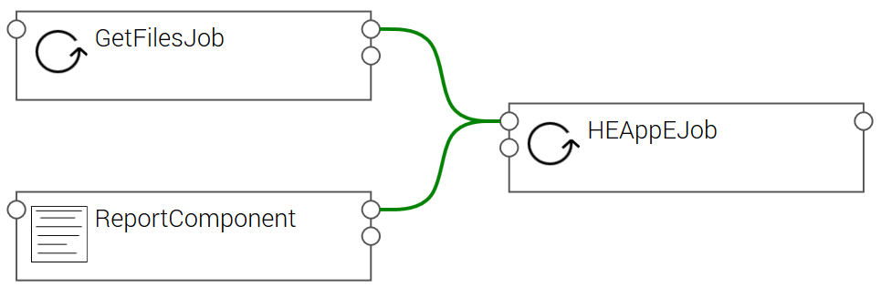

# TOSCA application using HEappE Middleware REST API

This repository provides an example of [TOSCA](http://docs.oasis-open.org/tosca/TOSCA-Simple-Profile-YAML/v1.2/TOSCA-Simple-Profile-YAML-v1.2.html) application template using [HEappE Middleware](https://code.it4i.cz/ADAS/HEAppE/Middleware/wikis/home) REST API.

This example can be uploaded/instantiated in [Alien4Cloud](http://alien4cloud.github.io/index.html), then deployed by the [Ystia Orchestrator](https://github.com/ystia/yorc/blob/develop/README.md) on HPC clusters managed by the HEappE Middleware.

The orchestrator has a built-in support for the deployment of applications on Google Cloud, AWS, OpenStack, SLURM, Kubernetes, Host Pools...
Its capabilities can also be extended through a plugin mechanism, where you can add the support for a new type of infrastructure with associated resources that the Orchestrator can create on demand.

But here, the example here shows a very lightweight implementation without plugin extension, were TOSCA components use directly HEAppE Middleware REST APIs.
Ystia front-end and orchestrator will just have here to execute the application workflows.

The following sections provide a detailed description of the application, its implementation, and how to use it in Ystia

* [Description of the application](doc/description.md)
* [Implementation](doc/implementation.md)
  * abstract types
  * concrete types
  * Topology template
* Using this template to create and deploy applications in Ystia
  * through the UI
  * through the REST API

Application template:

User-defined workflow:

