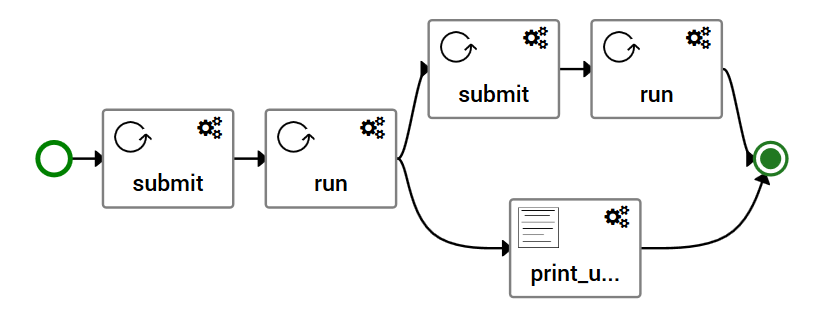

# Implementation


## Data types

In addition to built-in types defined in the YAML specification (string, integer, float, boolean, timestamp) and supported by TOSCA, you can define your own types in a section `data_types` of a TOSCA file.

This is what was done in [components/pub/types.yaml](../components/pub/types.yaml) to have data types that will be used by our components. The data types defined here are directly derived from types defined in [HEAppE Middleware](https://code.it4i.cz/ADAS/HEAppE/Middleware/wikis/home) API.

HEAppE Middleware defines a `JobSpecification` type having properties :
* `minCores`: minimum number of cores required
* `maxCores`: maximum number of cores required
* `tasks`: array of `TaskSpecification`
* ...

A `TaskSpecification` type has these properties :
* `minCores`: minimum number of cores required
* `maxCores`: maximum number of cores required
* `templateParameterValues` : array of `CommandTemplateParameterValue`
* ...

A `CommandTemplateParameterValue` type is a structure having these properties:
* `commandParameterIdentifier`: a string identifying a parameter
* `parameterValue` : a parameter value

The corresponding data type definition for a `commandTemplateParameterValue` defined in [components/pub/types.yaml](../components/pub/types.yaml) is:

```yaml
data_types:
  org.ystia.heappe.types.CommandTemplateParameterValue:
    derived_from: tosca.datatypes.Root
    properties:
      commandParameterIdentifier:
        description: Command parameter identifier
        type: string
        required: true
      parameterValue:
        description: Command parameter value
        type: string
```

Note here that the property `commandParameterIdentifier`  has the attribute `required` set to `true`, while this is not the case of `parameterValue`. You can also use the attribute `default` to specify a default value.

The `TaskSpecification` type property `templateParameterValues` which is array of `CommandTemplateParameterValue` is described this way in TOSCA:

```yaml
  org.ystia.heappe.types.TaskSpecification:
    derived_from: tosca.datatypes.Root
    properties:
      templateParameterValues:
        description: Command template parameters
        type: list
        entry_schema:
          type: org.ystia.heappe.types.CommandTemplateParameterValue
      ...
```

This is a property of type `list` whose type of elements are provided by the `entry_schema` type.

Similarly, the `JobSpecification` type property `tasks` which is array of `TaskSpecification` is described this way in TOSCA:
```yaml
  org.ystia.heappe.types.JobSpecification:
    derived_from: tosca.datatypes.Root
    properties:
      tasks :
        description: Tasks (at leat one task needs to be defined)
        type: list
        entry_schema:
          type: org.ystia.heappe.types.TaskSpecification
        required: true
      ...
```


## Abstract types

To show an example of inheritance, this example is defining abstract type. Next section will describe concrete types inheriting from these abstract components.

Other example of abstract types: the orchestrator is providing abstract types for resources (Compute Instance, Block Storage, Network...) of infrastructures it supports, that you can reference in your application template to have a portabke application, and when you will have selected on which location to deploy the application, Alien4Cloud will take care of substituting these abstract infrastucture resource types refernced in your application with concrete types, these concrete types having implementation of standard create/configure/start/stop/delete that the orechestrator wiil execute when running install/uninstall workflows.

Abstract types are defined here in [components/pub/types.yaml](../components/pub/types.yaml), in a section `node_types`.

The abstract type `Job` derives from the parent type `org.alien4cloud.nodes.Job` which is a component with additional interfaces corresponding to a job submit, run, cancel, as seen previously.
And this type `Job` defines:
* properties, which are configured by the user and won't change at runtime
* attributes, which will be set at runtime, like here the job ID that will return by HEAppe middleware once the job will be created
* a capability, that will allow to build a relationship between components having a requiremnent to be associated wih a HEAppE job, and this component having this capability

```yaml
node_types:
  org.ystia.heappe.components.pub.Job:
    derived_from: org.alien4cloud.nodes.Job
    abstract: true
    description: >
      HEAppE Job
    properties:
      heappeURL:
        description: URL of the HEAppE Middleware service
        type: string
        required: true
      user:
        description: User used to connect to HEAppE Middleware
        type: string
        required: true
      password:
        description: Password used to connect to HEAppE Middleware
        type: string
        required: true
      jobSpecification:
        description: Specification of the job to create
        type: org.ystia.heappe.types.JobSpecification
        required: true
    attributes:
      jobID:
        type: string
        description: >
          ID of the HEAppE job created
      sessionID:
        type: string
        description: >
          ID of the HEAppE session created
    capabilities:
      heappejob:
        type: org.ystia.heappe.capabilities.pub.HeappeJob

```

This capability is defined later in this file in section `capability_types`. A capability can have as well properties and attributes, here for this example there is no such need :

```yaml
capability_types:
  org.ystia.heappe.capabilities.pub.HeappeJob:
    derived_from: tosca.capabilities.Root
    description: >
      A capability fulfilling requirements of a node requiring to be
      associated with a HEAppE Job.
```

Then, the abstract type `GetFilesJob` with one requirement: it has to be associated to one job :
```yaml
  org.ystia.heappe.components.pub.GetFilesJob:
    derived_from: org.alien4cloud.nodes.Job
    abstract: true
    description: >
      Get files produced by a HEAppEJob
    requirements:
      - job:
          capability: org.ystia.heappe.capabilities.pub.HeappeJob
          node: org.ystia.heappe.components.pub.Job
          relationship: org.ystia.heappe.relationships.pub.DependsOnJob
          occurrences: [1, 1]
```

This component here has no properties or attributes, although it needs to known the job ID and the HEAppE middleware URL. We will see when describing the concrete type derived from this abstract type, that we will be able to get these values from the associated `Job` properties and attributes.
It is referencing a relationship `org.ystia.heappe.relationships.pub.DependsOnJob`. This relationship is defined later in this file in section `relationship_types`. As we saw previsouly, operations can be specified in a relationship to be executed on the source or on the target. Here we just define the expected target type of the relationship:

```yaml
relationship_types:
  org.ystia.heappe.relationships.pub.DependsOnJob:
    derived_from: tosca.relationships.DependsOn
    description: Relationship between a component and a HEAppE job
    valid_target_types: [ org.ystia.heappe.components.pub.Job ]
```


Then the abstract type `ReportComponent` is declared. It has the same requirement as `GetFilesJob` to be associated with one job, but here  `ReportComponent` is not a job, it is derived from `tosca.nodes.Root`, so it won't implemented job interfaces submit, run, cancel. We will see later that its concrete type will implement a custom interface:

```yaml
  org.ystia.heappe.components.pub.ReportComponent:
    derived_from: tosca.nodes.Root
    abstract: true
    description: >
      Prints a report of resources usage of a HEAppEJob
    requirements:
      - job:
          capability: org.ystia.heappe.capabilities.pub.HeappeJob
          node: org.ystia.heappe.components.pub.Job
          relationship: org.ystia.heappe.relationships.pub.DependsOnJob
          occurrences: [1, 1]
```

## Concrete types

Concrete types provide an implementation of abstract types described above. These types are defined in [components/linux/bash/types.yaml](../components/linux/bash/types.yaml), in a section `node_types`.

Interfaces will be implemented using bash scripts here. You can find example of ansible playbooks in the [Ystia Forge](https://github.com/ystia/forge/tree/develop/org/ystia), for example these [playbooks](https://github.com/ystia/forge/tree/develop/org/ystia/traefik/ansible-linux/playbooks) implementing a Træfik component (HTTP reverse proxy and load balancer). 

The concrete type `Job` we define here derives from is parent abstract type. It inherits properties, attributes, capabilites defined in its parent types and provide imeplementations for standard interfaces of a TOSCA componet (create/configure/start/stop/delete) and interfaces associated to a Job (submit/run/cancel).
We see here that the definition describes of the attributes jobID and sessionID will be set at runtime :

```yaml
  org.ystia.heappe.components.bash.Job:
    derived_from: org.ystia.heappe.components.pub.Job
    description: >
      HEAppE Job
    tags:
      icon: /images/job.png
    attributes:
      jobID: { get_operation_output: [SELF, Standard, create, JOB_ID] }
      sessionID: { get_operation_output: [SELF, tosca.interfaces.node.lifecycle.Runnable, submit, SESSION_ID] }
```
 
The TOSCA function `get_operation_output` instructs the Ystia orchestrator Yorc to retrieve a value at the end of a operation. In order to allow Yorc to retrieve those values, it is expected that the interface implementation will, depending on the language implementation :
 * in Bash scripts, export a variable named as the output variable (case sensitive)
 * in Python scripts, define a global variable named as the output variable (case sensitive)
 * in Ansible playbooks, set a fact named as the output variable (case sensitive)
 
 So here, it expected that the bash implemetation we provide for the standard interface `create`, will export a variable `JOB_ID`. And the badh implementation of the job interface submit will export a variable `SESSION_ID`.
 Then we describe which interfaces are implemented by our component. Here for the standard interfaces :
 
```yaml
    interfaces:
      Standard:
        inputs:
          HEAPPE_URL: {get_property: [SELF, heappeURL]}
          HEAPPE_USER: {get_property: [SELF, user]}
          HEAPPE_PASSWORD: {get_property: [SELF, password]}
        create:
          inputs:
            JOB_SPECIFICATION: {get_property: [SELF, jobSpecification]}
          implementation: scripts/create_job.sh
        # Added a no-op start operation just to have Alien4Cloud change the
        # component state to started
        start:
          implementation: scripts/noop.sh
        delete:
          inputs:
            JOB_ID: {get_attribute: [SELF, jobID]}
          implementation: scripts/delete_job.sh
```

We can see above that the create interface is implemented by script [scripts/create_job.sh](../components/linux/bash/scripts/create_job.sh) taking in input the specification of the job to create, which is a property of this component (TOSCA keywork `SELF`) as this property is declared in the parent abstract type, as we saw above.
This script [scripts/create_job.sh](../components/linux/bash/scripts/create_job.sh) will use curl commands to authenticate and create the job, then will export the value of the created job id in the environment variable `export JOB_ID`, so that it can be exposed as an attribute of this component like we saw above.


Then similarly, we describe how job interfaces are implemented:

```yaml
      tosca.interfaces.node.lifecycle.Runnable:
        inputs:
          HEAPPE_URL: {get_property: [SELF, heappeURL]}
          JOB_ID: {get_attribute: [SELF, jobID]}
        submit:
          inputs:
            HEAPPE_USER: {get_property: [SELF, user]}
            HEAPPE_PASSWORD: {get_property: [SELF, password]}
          implementation: scripts/submit_job.sh
        run:
          inputs:
            SESSION_ID: {get_attribute: [SELF, sessionID]}
          implementation: scripts/get_job_status.sh
        cancel:
          inputs:
            SESSION_ID: {get_attribute: [SELF, sessionID]}
          implementation: scripts/cancel_job.sh
```

We find then in this same file [components/linux/bash/types.yaml](../components/linux/bash/types.yaml), the definition of the concrete type for the ReportComponent, which is not a job, so here it is just implementing standard interfaces :
```yaml
  org.ystia.heappe.components.bash.ReportComponent:
    derived_from: org.ystia.heappe.components.pub.ReportComponent
    tags:
      icon: /images/print.png
    interfaces:
      Standard:
        start:
          implementation: scripts/noop.sh
      custom:
        print_usage:
          inputs:
            HEAPPE_URL: {get_property: [REQ_TARGET, job, heappeURL]}
            JOB_ID: {get_attribute: [REQ_TARGET, job, jobID]}
            SESSION_ID: {get_attribute: [REQ_TARGET, job, sessionID]}
          implementation: scripts/print_usage.sh
```

You see here that the custom interface `print_usage` implementation is expecting input parameters like the HEAppE middleware URL and the Job ID for which it needs to provide a usage report.
These parameter values are retrieved by the orchestrator Yorc using the TOSCA operation `get_property` or `get_attribute` with the first parameter `REQ_TARGET`. This parameter `REQ_TARGET` is an extension to TOSCA that is supported by Alien4Cloud and Yorc to easily retrieve properties or attributes of a target to which our component is associated through a requirement and a relationship.
Here `ReportComponent` parent type declared a requirement named `job` to describe this component has to be associated through a relationship to a `HEAppEJob`, and `get_property: [REQ_TARGET, job, heappeURL]`means Yorc will have to get the value of the property `heappeURL` of the associated `HEAppEJob`.


## Application template

An application template (*topology template* in TOSCA terminology) is also provided at [opology/simple-job/types.yaml](../topology/simple-job/types.yaml).
A first section `inpouts` describes input parameters for which a user who wants to deploy the application will provide values:

```yaml
topology_template:
  inputs:
    heappeURL:
      type: string
      required: true
      description: "HEAppE Middleware URL"
    ...
```

A second section `node_templates` describes components part of this application and their relationships, here `HEAppEJob`, then `GetFilesJob`and `ReportComponent` which depend on `HEAppEJob`:

```yaml
 node_templates:
    HEAppEJob:
      type: org.ystia.heappe.components.bash.Job
      properties:
        heappeURL: { get_input: heappeURL }
        user: { get_input: user }
        password: { get_input: password }
        jobSpecification: { get_input: jobSpecification }
    GetFilesJob:
      type: org.ystia.heappe.components.bash.GetFilesJob
      requirements:
        - associatedJob:
            type_requirement: job
            node: HEAppEJob
            capability: tosca.capabilities.Node
            relationship: org.ystia.heappe.relationships.pub.DependsOnJob
    ReportComponent:
      type: org.ystia.heappe.components.bash.ReportComponent
      requirements:
        - associatedJob:
            type_requirement: job
            node: HEAppEJob
            capability: tosca.capabilities.Node
            relationship: org.ystia.heappe.relationships.pub.DependsOnJob
```

Finally a last section `workflows` is described. This section here contains user-defined workflows if any.
While standard workflows install/uninstall will be automatically generated by Alien4Cloud by chaining each componnent standard interfaces create/configure/start for the install workflow, and stop/delete interfaces for the uninstall workflow, according to the relationships between these components.
Similarly for jobs, a run workflow will be generated autoamtically, chaining submit/run operations of jobs according to the relationships between these jobs (they run in parallel if they don't have any relationship).

Here we define a custom workflow to create a workflow that will take into acccount the custom interface `print_usage` of our `ReportComponent`, so that the workflow submit and runs first the `HEAppeJob` and when done, run in parrallel the `GetFilesJob` submission and the operation `print_usage ` of `ReportComponent`.

Which gives this workflow definition :
```yaml
    myWorkflow:
      steps:
        HEAppEJob_submit:
          target: HEAppEJob
          activities:
            - call_operation: tosca.interfaces.node.lifecycle.Runnable.submit
          on_success:
            - HEAppEJob_run
        HEAppEJob_run:
          target: HEAppEJob
          activities:
            - call_operation: tosca.interfaces.node.lifecycle.Runnable.run
          on_success:
            - ReportComponent_print_usage
            - GetFilesJob_submit
        GetFilesJob_submit:
          target: GetFilesJob
          activities:
            - call_operation: tosca.interfaces.node.lifecycle.Runnable.submit
          on_success:
            - GetFilesJob_run
        GetFilesJob_run:
          target: GetFilesJob
          activities:
            - call_operation: tosca.interfaces.node.lifecycle.Runnable.run
        ReportComponent_print_usage:
          target: ReportComponent
          activities:
            - call_operation: custom.print_usage
```

that will result in this graphical view of the workflow in Alien4Cloud once this template will be uploaded as described in next page :




Next: [Using this template to create and deploy applications in Ystia](using_ystia.md)
