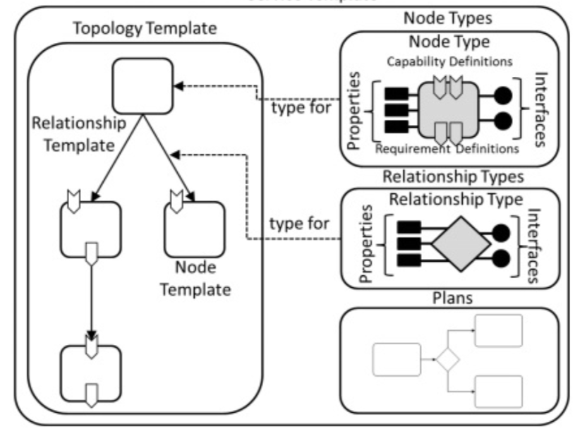

# Introduction to TOSCA

## Specification

[TOSCA](https://docs.oasis-open.org/tosca/TOSCA-Simple-Profile-YAML/v1.2/os/TOSCA-Simple-Profile-YAML-v1.2-os.html) (Topology
and Orchestration Specification for Cloud Applications) is a standard allowing to provide a model for an application, its components, relationships between these components, dependencies, requirements, and capabilities.

It enables portability and automated management across cloud providers regardless of underlying platform or infrastructure.

The following figure explains how the core concepts work together:



The **Topology Template** defines the structure of the application. It consists in a set of node templates and and relationship templates.

A **Node Template** specifies the occurrence of a software component node as part of a Topology Template.

Each node template refers to a **Node Type** that defines the semantics of the node (properties, attributes, requirements, capabilities, interfaces).

A **Relationship Template** specifies the occurrence of a relationship between nodes in a Topology Template. Each Relationship Template refers to a Relationship Type that defines the semantics of the relationship (properties, attributes, interfaces).

In addition **workflows** (sometimes called plans) describe how the orchestrator will administrate the TOSCA application. A workflow is a collection of steps, a step can be a state change, the execution of a node interface, etc... And a step can be dependent on other steps.

TOSCA specification defines normatives types, for which Ystia provides a built-in implementation, and from which the node types you will write will derive.

For example the TOSCA specification defines a [TOSCA Root Node Type](https://docs.oasis-open.org/tosca/TOSCA-Simple-Profile-YAML/v1.2/os/TOSCA-Simple-Profile-YAML-v1.2-os.html#_Toc528072956), which is the default type all other TOSCA Node Types derive from.
This specification defines that this root type has a set of [standard interfaces](https://docs.oasis-open.org/tosca/TOSCA-Simple-Profile-YAML/v1.2/os/TOSCA-Simple-Profile-YAML-v1.2-os.html#DEFN_TYPE_ITFC_NODE_LIFECYCLE_STANDARD) :
* create
* configure
* start
* stop
* delete

You can find the corresponding normative types implementation in the orchestrator code at [data/tosca/normative-types.yml](https://github.com/ystia/yorc/blob/develop/data/tosca/normative-types.yml).

For example, the Ystia orchestrator definition of the Root node type with its standard interfaces as described in the TOSCA specification :

```yaml
node_types:
  tosca.nodes.Root:
    description: >
      The TOSCA Root Node Type is the default type that all other TOSCA base Node Types derive from.
      This allows for all TOSCA nodes to have a consistent set of features for modeling and management
      (e.g., consistent definitions for requirements, capabilities and lifecycle interfaces).
    ...
    capabilities:
      feature:
        type: tosca.capabilities.Node
    requirements:
      - dependency:
          capability: tosca.capabilities.Node
          node: tosca.nodes.Root
          relationship: tosca.relationships.DependsOn
          occurrences: [ 0, UNBOUNDED ]
    interfaces:
      tosca.interfaces.node.lifecycle.Standard:
        create:
          description: Standard lifecycle create operation.
        configure:
          description: Standard lifecycle configure operation.
        start:
          description: Standard lifecycle start operation.
        stop:
          description: Standard lifecycle stop operation.
        delete:
          description: Standard lifecycle delete operation.
```

You can see above that the Root Node Type is exposing a capability called `feature`, and is expressing a requirement `dependency`that can be fulfilled by a given capability type from a given node types through a given relationship type.

This capability and requirement described in the Root Node Type will be inherited by any type derived from the Root Node Type, and will allow you to create a relationship between two different node templates in your topology template.

You will also be able to add to the node types you will create, other capabilites of your own capability types, other requirements and other relationships of your own relationship type.
 
Similarly to standard interfaces (create, configure, etc...) defined on a Node Type, standard interfaces are defined in a Relationship, that will allow you to run operation depending on the state of the source or the target of the relationship.
The definition of the Root Relationship Type provides this definition for interfaces that can be associated to a relationship :

```yaml
relationship_types:
  tosca.relationships.Root:
    description: The TOSCA root Relationship Type all other TOSCA base Relationship Types derive from
    ...
    interfaces:
        tosca.interfaces.relationship.Configure:
          description: >
            The lifecycle interfaces define the essential, normative operations that each TOSCA Relationship Types may support.
          pre_configure_source:
            description: Operation to pre-configure the source endpoint.
          pre_configure_target:
            description: Operation to pre-configure the target endpoint.
          post_configure_source:
            description: Operation to post-configure the source endpoint.
          post_configure_target:
            description: Operation to post-configure the target endpoint.
          add_target:
            description: Operation to notify the source node of a target node being added via a relationship.
          add_source:
            description: Operation to notify the target node of a source node which is now available via a relationship.
          remove_target:
            description: Operation to notify the source node of a target node being removed from a relationship.
          remove_source:
            description: Operation to notify the target node of a source node being removed from a relationship.
```

## Properties and Attributes

Node types, capability types, relationship types, interfaces described above can have associated properties and attributes.

A property is provided a value defined before the application is deployed.
While an attribute will have its value set by the orchestrator at runtime.

To assign a value to a property or an attribute, TOSCA specification is introducing TOSCA functions that an orchestrator has to support, this is a short description here, the example described later will show concrete usages of of these functions: 
* **get_input** to get the value of an input parameter of the Topology Template
* **get_property** to get the value of a property of a given node template, or one of it capability/relationship property. The following Keywords can also be used to reference the entity :
  * **SELF** for the entity holding this function,
  * **HOST** for one of the hosts (in the hosted-on hierarchy) of the entity holding this function,
  * **SOURCE**, **TARGET** respectively for the source or the target entity in case of a relationship
* **get_attribute** equivalent of get_property for attributes
* **get_operation_output** to retrieve the output of an interface execution, our example will show a concrete example of this to retrive the Job ID from the HEAppeJob create interface output

See additional details in the [Ystia Orchestrator documentation](https://yorc.readthedocs.io/en/latest/tosca.html).

## TOSCA extensions brought by Ystia

### Jobs

In addition to the standard lifecycle interfaces defined by TOSCA specification: create, configure, start... Ystia has extended TOSCA to support the lifecycle of a job.

A new interface `tosca.interfaces.node.lifecycle.Runnable` has been added with these interfaces:
* **submit** submits a job to a Job Scheduler, generally at the end of the submit we got a job identifier
* **run** asynchronous operation called periodically to check the job status, until the job is done (success or failure)
* **cancel** allows to cancel a submitted job.

As this is an extension to TOSCA, this definition is not found in [data/tosca/normative-types.yml](https://github.com/ystia/yorc/blob/develop/data/tosca/normative-types.yml) like ofr the normative types described in the previous section.
It is defined at [data/tosca/yorc-types.yml](https://github.com/ystia/yorc/blob/develop/data/tosca/yorc-types.yml)
The root type of a Job from which we will inherit in the Job type we will define for our example application described in next page is `org.alien4cloud.nodes.Job`:

```yaml
  org.alien4cloud.nodes.Job:
    abstract: true
    derived_from: tosca.nodes.Root
    description: >
      A job is a component that has a run operation.
    interfaces:
      tosca.interfaces.node.lifecycle.Runnable:
        submit:
          description: Submit a job to an engine.
        run:
          description: Monitor a submitted job for completion.
        cancel:
          description: Cancel a submitted job.
```

### Standard Workflows automatic generation

The specification defines two standard workflows :
  * **install** used to deploy a topology.
  * **uninstall** used to tear down a topology.
  
Ystia adds 2 additional default workflows:
  * **stop** used in conjunction with the start workflow to stop all components a topology (for maintenance purpose for example).
  * **start** sed in conjunction with the stop workflow to start all components of a topology.
  

All these standard workflows will be automatically generated for you by Alien4Cloud, that will create workflow steps calling the standard interfaces of the components you have implemented (create/configure/start for the install workflow, stop/delete for the uninstall workflow, submit/run for the run workflow of Jobs), dependencies between steps being set according to the relationships between node templates that you have defined in your topology template.

Similarly for topolgy templates containing jobs, implementing the interfaces submit/run/cancel that Ystia defines as a TOSCA extension, a **run** workflow will be automatically generated, chaining submit/run interfaces of each Job according to the relationships defined between these Jobs.

### Additional keyword

We mentioned above, keywords like SELF, SOURCE, TARGET, 

## Additonal documentation

To get more details, you can read the following documents:
* [TOSCA specification](https://docs.oasis-open.org/tosca/TOSCA-Simple-Profile-YAML/v1.2/os/TOSCA-Simple-Profile-YAML-v1.2-os.html#DEFN_TYPE_ITFC_NODE_LIFECYCLE_STANDARD)
* [Alien4Cloud TOSCA usage guide](http://alien4cloud.github.io/#/documentation/2.1.0/devops_guide/dev_ops_guide.html)
* [Alien4Cloud step by step guide writing your own component](http://alien4cloud.github.io/#/documentation/2.1.0/devops_guide/design_tutorial/tutorials_component_design.html)
* [Ystia Orchestrator TOSCA support documentation](https://yorc.readthedocs.io/en/latest/tosca.html)


Next: [Description of the application](description.md)
