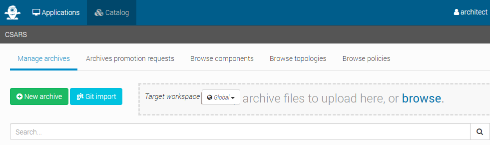
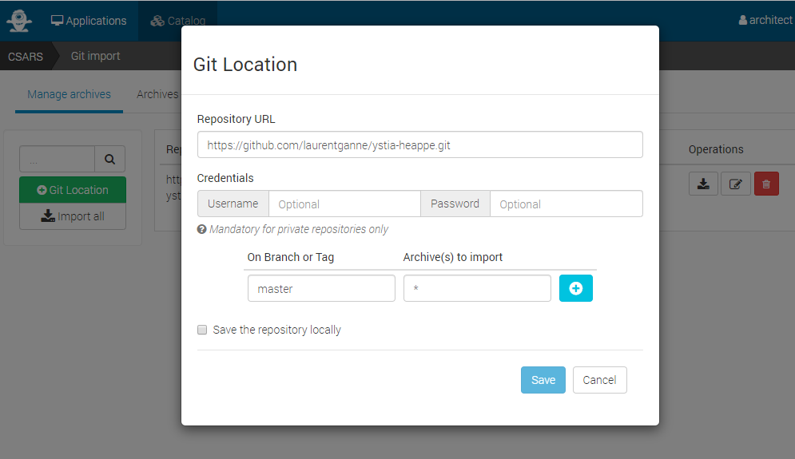
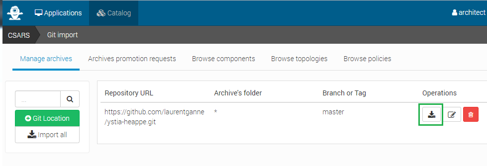
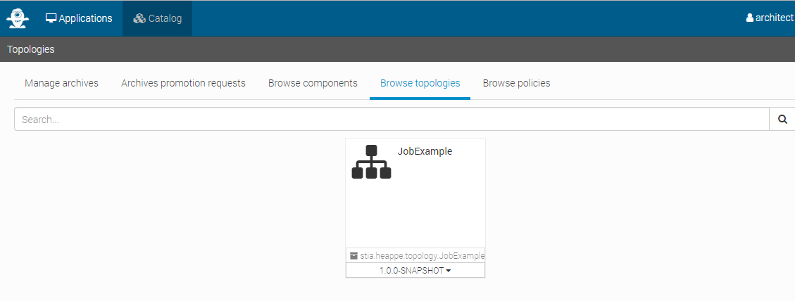

# Using the topology template to create and deploy applications in Ystia

## Prerequisites

This example is using node templates that don't have a requirement to be hosted on a 
Compute Instance.

No compute instance will be created on demand here. To be able to execute the scripts associated 
to our components interfaces, a specific configuration of the orchestrator is required, as by default it will refuse to execute such operations.

This can be done modifying yorc configuration (in /etc/yorc/config.yorl.yaml if you used Yorc bootstrap to install your setup) as described in [Yorc configuration documentation](https://yorc.readthedocs.io/en/latest/configuration.html#option-ansible-sandbox-hosted-ops-cfg).

For example, this is a configuration that you can use in tests/development environments, where you allow the orchestrator Yorc to execute such non-hosted operations directly on the host where it is running:

```yaml
ansible:
  hosted_operations:
    unsandboxed_operations_allowed: true
```

And this is a configuration where Yorc is configured to execute such non-hosted operations within a docker container using an image of you choice:

```yaml
ansible:
  hosted_operations:
    unsandboxed_operations_allowed: false
    default_sandbox:
      image: python:2.7-stretch
```
Then a restart of yorc is needed.

Once done, this example (components and topology template) can be uploaded in Alien4Cloud catalog.

Next section describe how to do it from Alien4Cloud UI.

## through the UI

First login on Alien4Cloud as a user who has at least the following roles:
* **COMPONENT_MANAGER** to upload new components in Alien4Cloud catalog
* **ARCHITECT** to upload toplogy templates in Alien4Cloud catalog

Then, from Alien4Cloud select menus **Catalog** > **Manage Archives**, you can either upload zip files, or upload a git repository :



This is what we'll do here, clicking on **Git import**. A page appears where you can click on **Git location** to add a git location.
Enter:
* the repository: URL https://github.com/laurentganne/ystia-heappe.git
* the branch: master
like below :




Click on **+** to add this branch, then click on **Save** to add this git location.
This page appears, click on **Import** to import components and the topology template in the catalog:



If you select menus  **Catalog** > **Browse topologies**, you should now see in Alien4Cloud catalof the topology template provided by this repository:



Then to be able to create an application from this topology template, you need to login as a user who has the role **APPLICATION_MANAGER**.
Select the menu ***Application** to have this page :


## through the REST API
