# Using the topology template to create and deploy applications in Ystia

## Prerequisites

This example is using node templates that don't have a requirement to be hosted on a 
Compute Instance.

No compute instance will be created on demand here. To be able to execute the scripts associated 
to our components interfaces, a specific configuration of the orchestrator is required, as by default it will refuse to execute such operations.

This can be done modifying yorc configuration (in /etc/yorc/config.yorl.yaml if you used Yorc bootstrap to install your setup) as described in [Yorc configuration documentation](https://yorc.readthedocs.io/en/latest/configuration.html#option-ansible-sandbox-hosted-ops-cfg).

For example, this is a configuration that you can use in tests/development environments, where you allow the orchestrator Yorc to execute such non-hosted operations directly on the host where it is running:

```yaml
ansible:
  hosted_operations:
    unsandboxed_operations_allowed: true
```

And this is a configuration where Yorc is configured to execute such non-hosted operations within a docker container using an image of you choice:

```yaml
ansible:
  hosted_operations:
    unsandboxed_operations_allowed: false
    default_sandbox:
      image: python:2.7-stretch
```
Then a restart of yorc is needed.

Once done, this example (components and topology template) can be uploaded in Alien4Cloud catalog.

Next section describe how to do it from Alien4Cloud UI.

## through the UI

First login on Alien4Cloud as a user who has at least the following roles:
* **COMPONENT_MANAGER** to upload new components in Alien4Cloud catalog
* **ARCHITECT** to upload toplogy templates in Alien4Cloud catalog

Then, from Alien4Cloud select menus **Catalog** > **Manage Archives**, you can either upload zip files, or upload a git repository :


This is what we'll do here, clicking on **Git import**. A page appears where you can click on **Git location** to add a git location.
Enter:
* the repository URL: https://github.com/laurentganne/ystia-heappe.git
* the branch: master

like below :


Click on **+** to add this branch, then click on **Save** to add this git location.
This page appears, click on **Import** to import components and the topology template in the catalog:


If you select menus  **Catalog** > **Browse topologies**, you should now see in Alien4Cloud catalof the topology template provided by this repository:


Then to be able to create an application from this topology template, you need to login as a user who has the role **APPLICATION_MANAGER**.
Select the menu ***Application** to have this page :

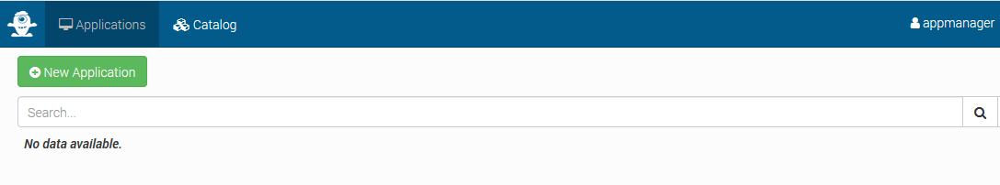

Click on **New Application**, a popup appears where you need to provide a name for the application, and select how to create it, from scratch (creating it graphically by dragging and dropping components from Alien4Cloud catalog in a topology editor), or from a topology template in the catalog, this is what we do here select the topology template we uploaded above :

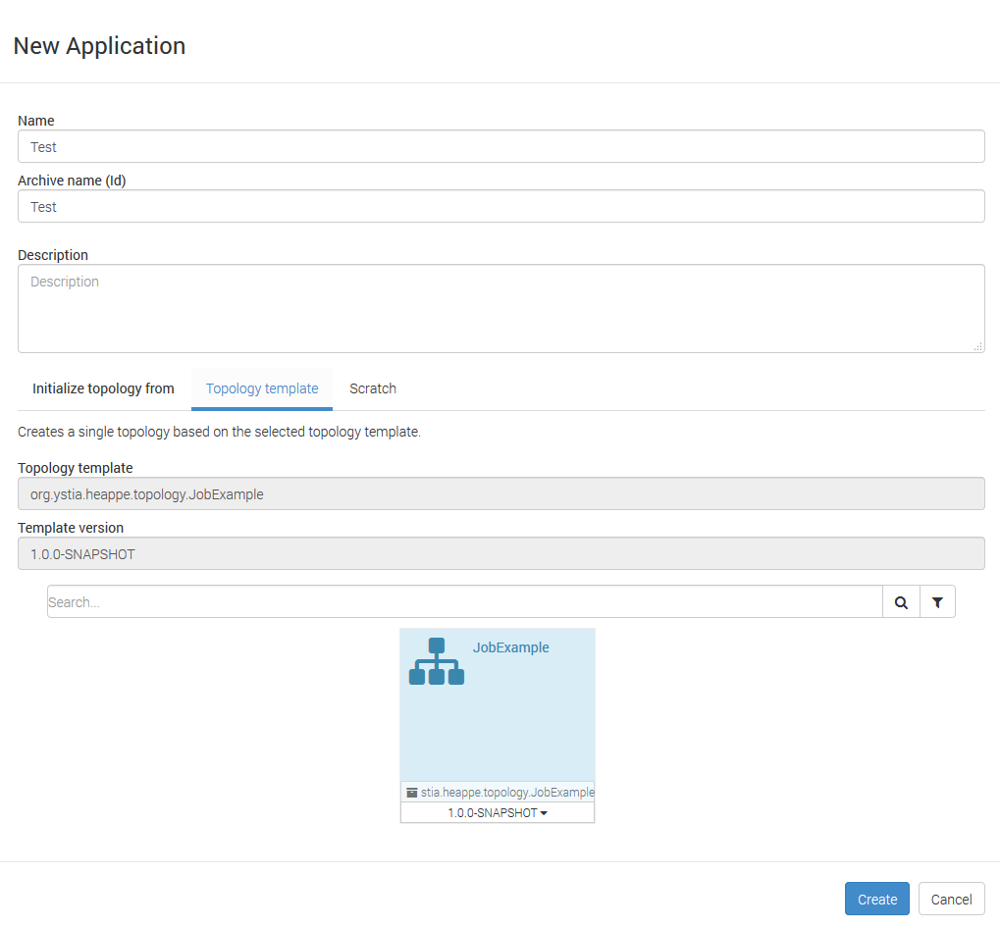

Click on **Create**, your application is created :

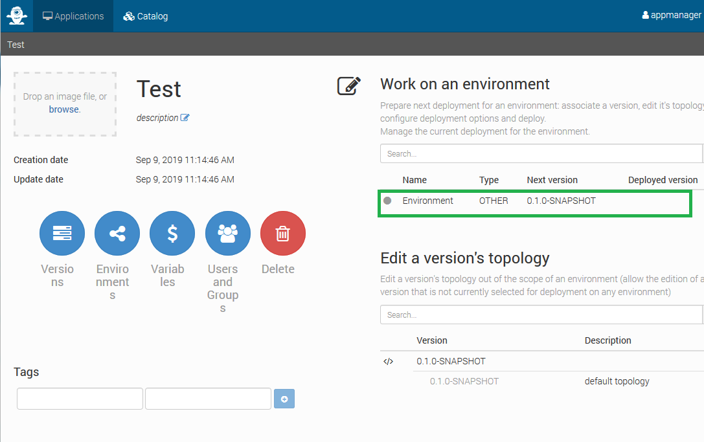

Click on the line Environment surrounded in green above, and a deployment wizard appears :

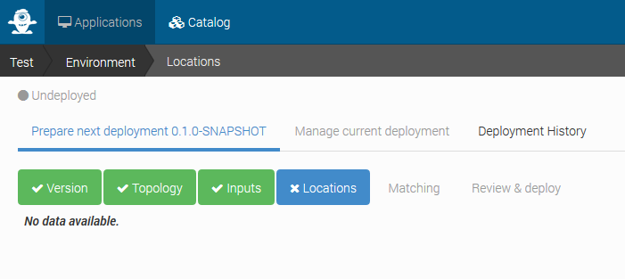

You could select the tab **Topology** to edit the toplogy if you need to change anything.
Else select the tab **Inputs** to provide inputs, mandatory inputs appear in red :

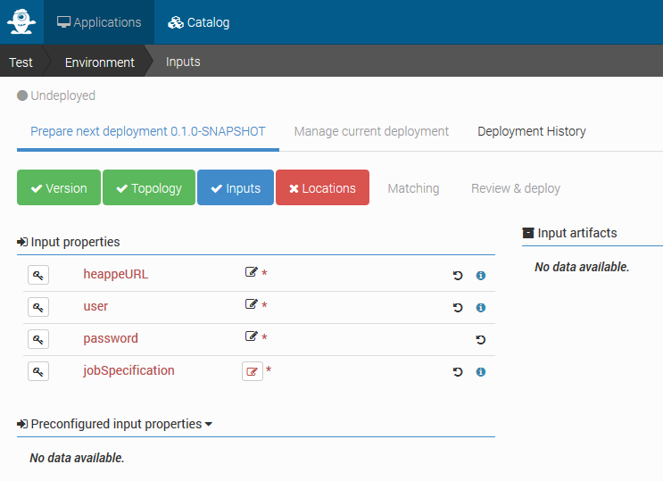

Once done, select tab **Location** and select the location where to deploy the application. Actually our application doesn't need any infrastructure resources to create on demand, this selection here will just select the orchestrator that will execute HEAppE commands :

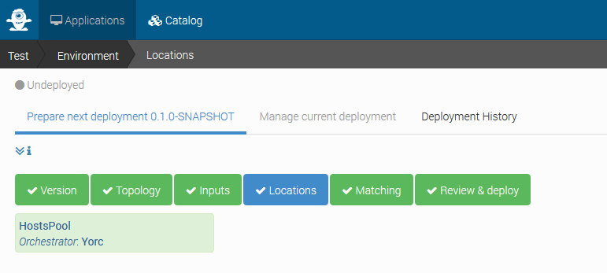

Once done, click on tab **Review & Deploy**, you are ready to deploy the application :

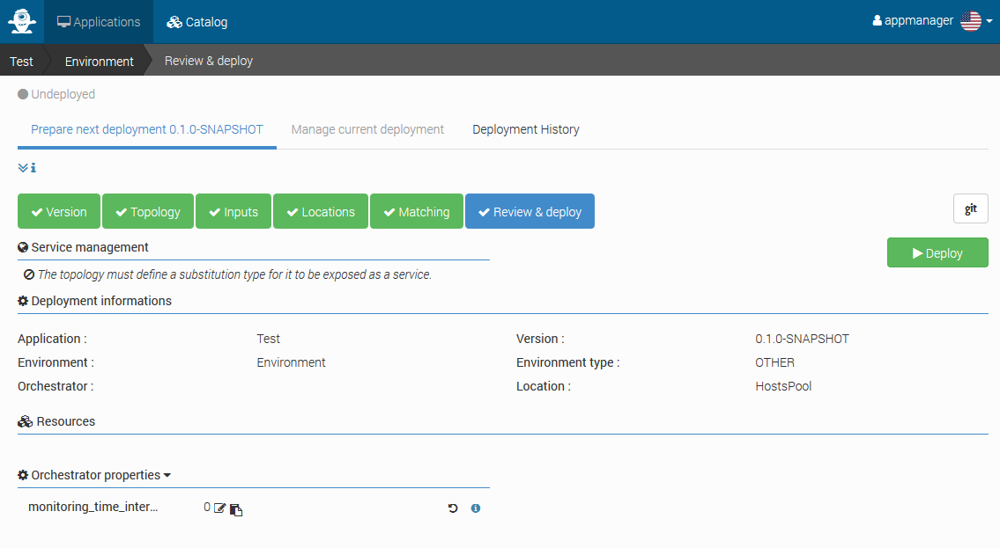

Click on **Deploy**, the deployment will take place, it will execute the **workflow**, which in our case will create a HEAppE job according to the job specification provided in input. Once done, this page appears describing the installation was successful :

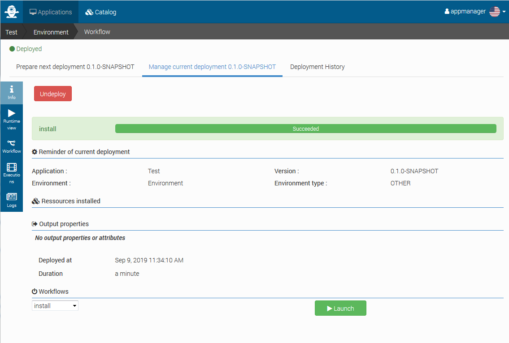

If you select the tab **Workflow** on the left hand side, you can see the install workflow that was executed :

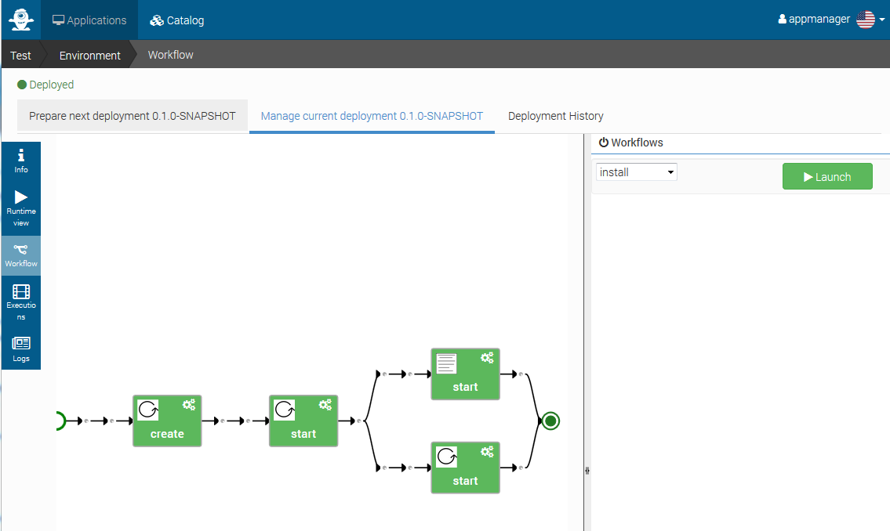

The **create** interface of **HEAppEJob** was called, then the **start** interface as we didn't implement any **configure** interface. Then the **start** interfaces of both components having a dependency on  **HEAppEJob** are called in parallel.

If, from the top right corner, you select the **run** workflow, you will see the automatically generated workflow chaining the **submit** and **run** of jobs **HEAppEJob** and **GetFilesJob** :

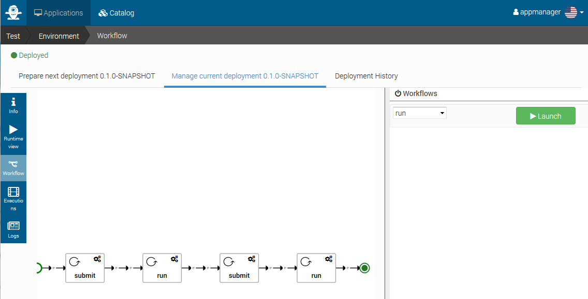

If, from the top right corner, you select the **myWorkflow** workflow, you will see our user-defined workflow, where once **HEAppEJob** has been run, we execute in parallel the interface **print_usage** of **ReportComponent** and the **submit**/**run** interfaces of **GetFilesJobs** :

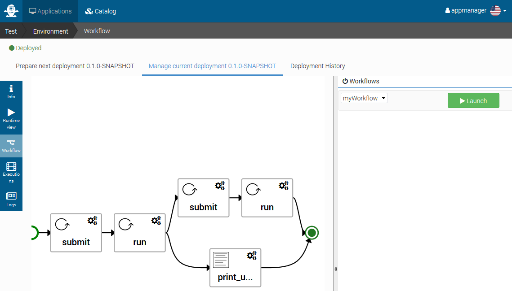

Clicking on **Launch**, the workflow is launched and you can follow its progress. Here the **HEAppEJob submit** was executed successfuly (the job was submitted), and the **HEAppE run** is in progress (called periodically to get the job state, until the job is done) :

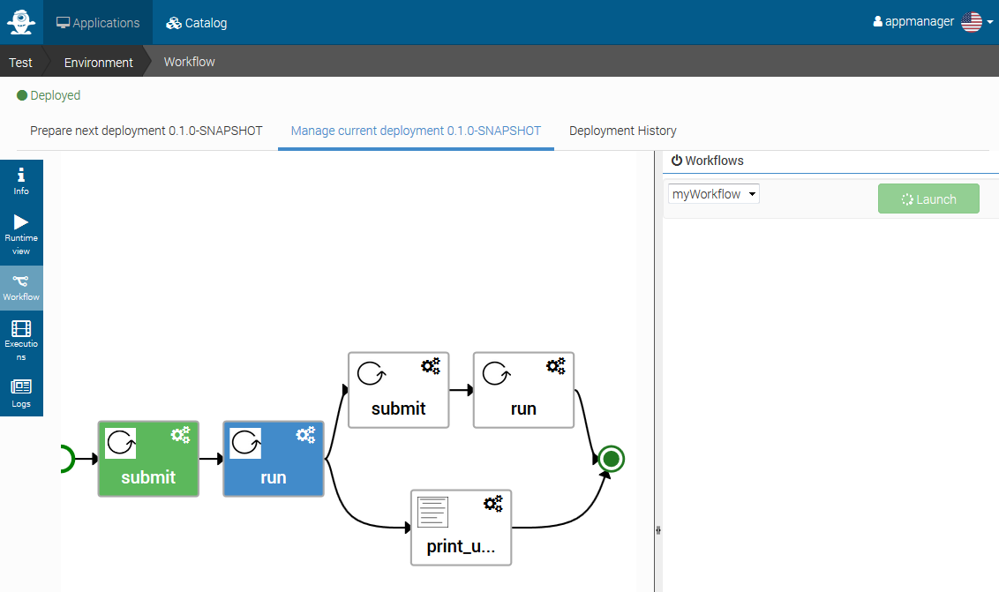

To view logs, you can click on tab **Logs** on the left hand side. For example here, logs from the **ReportComponent print_usage** printing resources usage of the job :

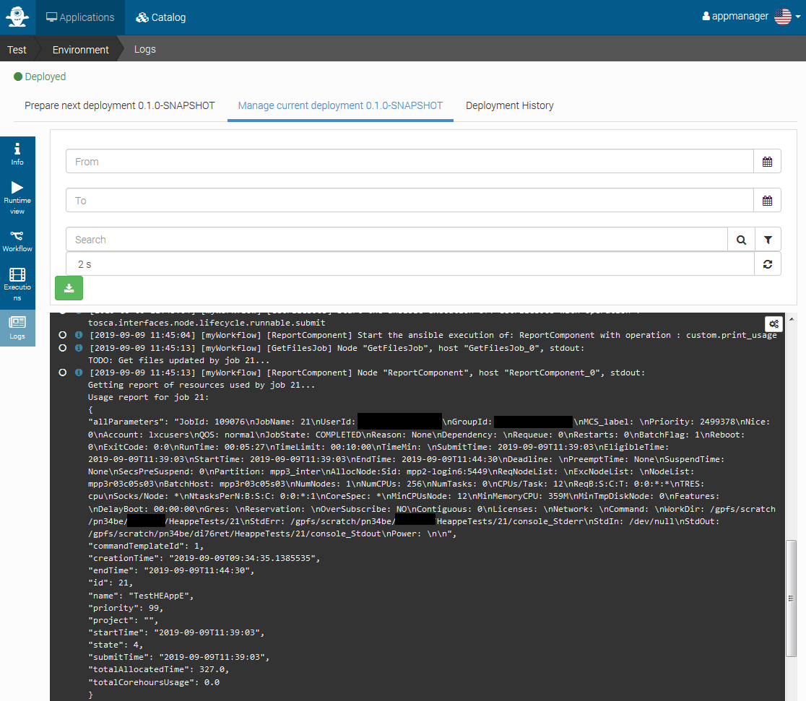


## through the REST API

To be completed.

